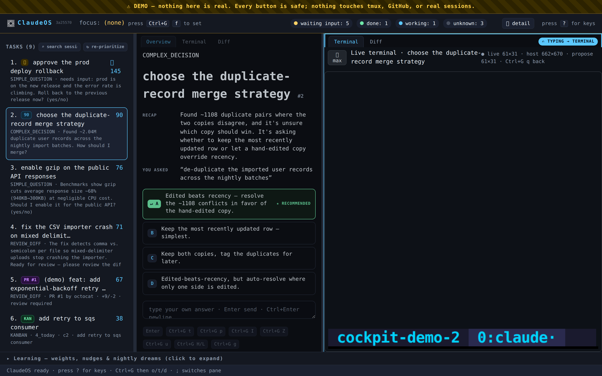
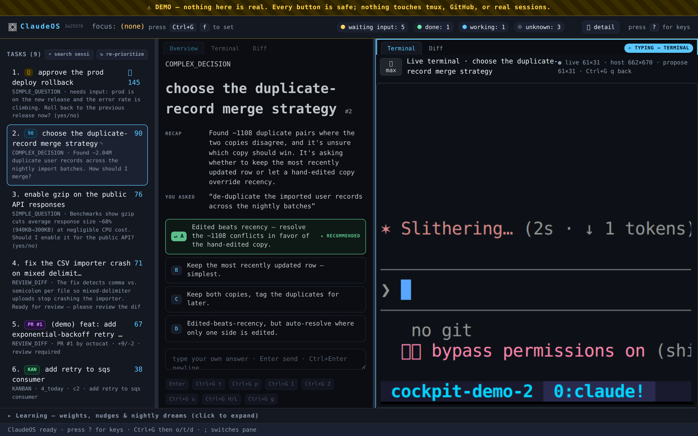
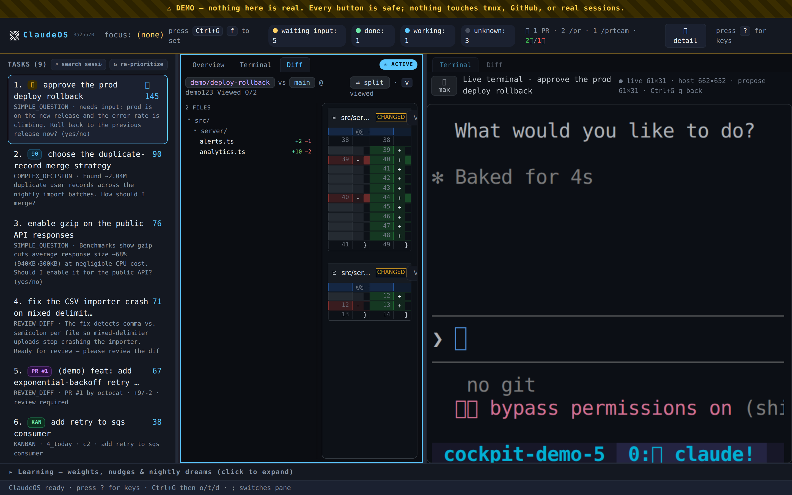
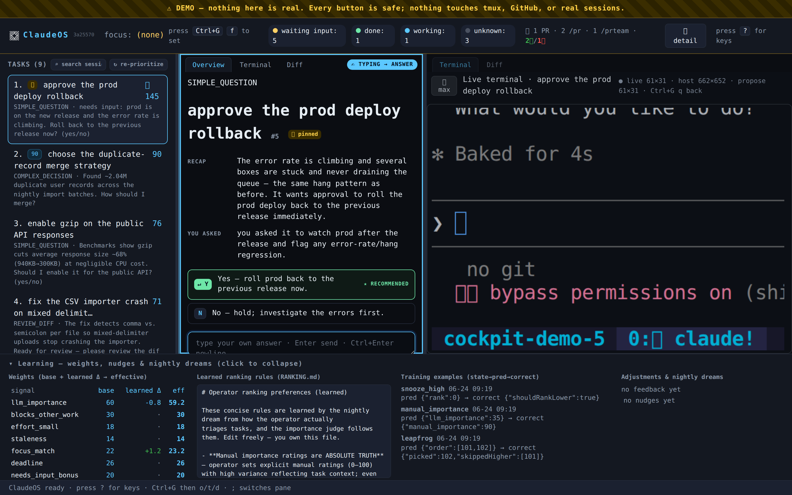

<div align="center">


# ClaudeOS

### One screen that tells you *which* of your Claude Code sessions actually needs you next.

**For people running 5, 10, 50 terminals at once.**

`SCAN → TRIAGE → DRAFT → RANK → DECIDE → LEARN` — a local control surface for a fleet of Claude Code sessions.
No API key. Your data stays on your machine. It learns your priorities and gets sharper every night.

</div>

---

> **Do you run more than one Claude Code session at a time?**
> On the **Max 20× plan**, because — let's be honest — one Claude was never going to be enough?
>
> Congratulations: you now have a *new* problem. Twenty terminals, twenty blinking cursors, and no
> idea which one has been quietly waiting on *you* for the last twenty minutes and which one is just
> happily running a test suite. **ClaudeOS is the fix for that problem.**
>
> If you run **one or two** sessions, honestly — keep doing what you're doing, you won't feel the
> pain this removes. Somewhere around **5+ concurrent sessions** a human brain stops being able to
> track them and a wall of tmux tabs stops being a workflow. *That's* where this earns its keep. It
> scales happily to dozens on one screen.

---

## The problem this solves

You started with one Claude Code terminal. Then five. Now you've got twenty tmux panes and you
genuinely cannot tell which one is **waiting on you**, which is **still grinding**, and which
**finished an hour ago and is just sitting there**. You alt-tab in circles. The important question
is buried three windows deep while you babysit one that didn't need you at all.

You tried cloud agents. They're fine for fire-and-forget, but when the work is **hard and
exploratory** — the kind where you stay in the loop and make the calls — they don't give you the one
thing you need: **a ranked, transparent, always-honest answer to "what needs me right now?"**

## See it in action

<div align="center">


<sub>A walk through the **demo** (everything fake — `npm run demo:serve`, nothing real is touched): the ranked queue, a drafted answer with options, the split diff, and the transparent learning panel. · <a href="docs/media/claudeos-demo.mp4">▶ higher-quality MP4</a></sub>

</div>

<table>
<tr>
<td width="50%"></td>
<td width="50%"></td>
</tr>
<tr>
<td><b>The ranked queue</b> — only the sessions that need you, each scored transparently.</td>
<td><b>A drafted answer</b> — the question distilled to a line, with a suggested reply + options.</td>
</tr>
<tr>
<td></td>
<td></td>
</tr>
<tr>
<td><b>GitHub-style split diff</b> — review a session's change inline, then merge.</td>
<td><b>It learns</b> — transparent weights, learned ranking rules, nightly "dreams".</td>
</tr>
</table>

## The core trick: Claude is genuinely bad at telling you when it needs you

Here's the dirty secret of running agents at scale: a Claude Code session is **terrible at
signalling whether it's blocked on *you* or just waiting on its own script.** It goes quiet
mid-`npm test`, and it goes quiet when it's stuck on a decision it needs you to make — and from the
outside, **those two look identical.** That's the whole reason staring at 20 terminals is exhausting.

ClaudeOS fixes exactly that. Every few seconds it reads the tail of each session's transcript and
runs a **small Claude model (Sonnet / Haiku) as a judge** over the output, asking one question:

> *Does a human actually need to act here — or is this thing just waiting on a build, a test, or an
> agent it kicked off itself?*

Only the sessions that **genuinely need you** ever surface. Everything else stays hidden. That one
judgement — *needs-a-human* vs *just-waiting-on-a-script* — is the thing ClaudeOS is built to get
right, and it's the hard rule everything else hangs off:

> ### The hard rule
> **A session is shown only when it genuinely needs you** (waiting on input) **or is done.** Anything
> still working — or even *ambiguously* working — stays hidden. No more "is this one stuck, or
> thinking?" When in doubt, it stays quiet.

And it's not a vibe — it's a **measured number.** A goldset eval scores the gate and gates the build
on **false-surface rate == 0**: a still-working session must *never* leak into your queue.

## What it actually does

```
                  ┌──────────────────────────────────────────────┐
   ~20+ Claude     │   ClaudeOS engine  (one 5s tick = pipeline)  │
   Code sessions   │                                              │      one ranked queue
   in tmux /  ───► │  SCAN  ▸ detect WORKING / WAITING / DONE     │ ───► "Up Next"  +  the
   git worktrees   │  TRIAGE▸ question? diff? decision? fyi?       │      drafted answer,
                   │  DRAFT ▸ one-liner + suggested reply         │      one keystroke to send
                   │  RANK  ▸ transparent score, every term shown │
                   │  LEARN ▸ nightly, from your own decisions    │
                   └──────────────────────────────────────────────┘
```

- **It hides the noise** — the hard rule above, enforced in one place
  ([`src/core/stateDetector.ts`](src/core/stateDetector.ts) + the model gate).
- **It ranks what's left, transparently.** Every item gets a score you can read: importance,
  does-it-block-other-work, effort, staleness, your current focus, deadlines — plus nudges it
  *learned* from you. Open the breakdown and see exactly why #1 is #1.
- **It drafts the answer.** Simple question → suggested reply; a diff → a summary of the change; a
  real decision → the options laid out. Hit one key to send, or edit first.
- **It explains everything visually.** A clean HTML/terminal UI: the ranked queue, a live terminal
  per session, a GitHub-style split **diff** view, and an **HTML pane** that auto-surfaces any report
  a session generates. Easy to navigate, easy to prioritize — a much more advanced "agents" view.
- **It learns your taste.** Bump something up or down (optionally say *why*), accept or rewrite a
  draft — and every night ClaudeOS folds those decisions into per-category nudges and a small learned
  weight vector. **Fully interpretable** (every change is logged), tuned toward **your** sense of
  what matters. The thing that prioritizes your work gets better while you sleep.
- **It runs headless.** The engine lives on the box where your sessions run; you drive it from a
  browser on your laptop (or the optional Electron desktop shell, with native notifications when a
  session needs you).

## See it in 60 seconds (fully sandboxed — no setup, no Claude calls)

You need **Node ≥ 22.5** (built-in `node:sqlite` — no native build step, no DB to install).

```bash
git clone <your-clone-url> claudeos && cd claudeos
npm install                 # postinstall wires the build/test git hooks
npm run demo:serve          # → http://localhost:4318   (fake sessions, touches nothing real)
```

Open `http://localhost:4318` and play: mixed-state demo sessions, the ranked queue, the priority
breakdown, the diff view, the keyboard. It never reads your real sessions or calls Claude.

## Run it for real

**By default ClaudeOS runs entirely on your own machine** — the engine, the terminals, everything.
Nothing needs a second computer, a server, or SSH. Start it and open it in your local browser:

```bash
npm run serve               # → http://localhost:4317   (watches your real ~/.claude sessions)
# then open http://localhost:4317 in your browser on the same machine
```

Prefer a native window? `npm start` launches the **desktop app** (Electron) instead — same UI, plus
native notifications and a global summon hotkey. Either way, the terminals run **locally**; nothing
leaves your computer.

Wire in work — launch a brand-new isolated session (its own git worktree + branch, auto-trusted), or
just let it auto-discover the sessions you already started:

```bash
node dist/cli.js launch /path/to/repo "fix the flaky search test" "Investigate and fix tests/search…"
node dist/cli.js list
```

<details>
<summary><b>Optional — run it on a separate / headless machine</b></summary>

If your Claude sessions live on a *different* box (a headless server, a beefy remote dev machine),
run the ClaudeOS server **there** and drive it from your laptop's browser over an SSH tunnel. The
engine and the terminals stay on the server; your laptop is just the screen:

```bash
# on the server (where the sessions run):
npm run serve                              # → http://0.0.0.0:4317
# on your laptop:
ssh -L 4317:localhost:4317 <your-host>     # then open http://localhost:4317
```

Set `COCKPIT_SSH_HOST=<your-host>` so the in-app "attach" buttons point at the right box. The
optional desktop app can also open a fast local terminal straight over `ssh + tmux` to that host.
This multi-machine mode is purely opt-in — the default above is fully local.
</details>

👉 **Full setup, configuration, and first-run notes: [`SETUP.md`](SETUP.md).** Architecture and the
terminal model: [`CLAUDEOS.md`](CLAUDEOS.md). The ranking math:
[`HOW_PRIORITIZATION_WORKS.md`](HOW_PRIORITIZATION_WORKS.md). The safety gate in depth:
[`STATE_DETECTION_GATE.md`](STATE_DETECTION_GATE.md).

## Safe, private, no API keys

- **No Anthropic API key. Anywhere.** Every model call — triage, summaries, the ready-gate judge —
  goes through **your own Claude Code subscription** via the `claude` CLI. (Yes: the same Max plan
  you're already paying for.) There are no credentials in this repo and none to add.
- **All your data is local, in open formats:** SQLite (`data/cockpit.db`) + JSON. You own it, you can
  read it, it never leaves your machine. `data/`, `*.db`, `node_modules/`, and per-session worktrees
  are gitignored.
- **No secrets in this repo by design** — there's nothing to leak because there's nothing here.

## Keyboard (press `?` for the overlay)

Terminal-first: landing on a task focuses its **live terminal** — what you type goes to the session.
Plain `↑`/`↓` always walk the queue; every other action is behind a single **master key** (`Ctrl+G`
by default) so a stray letter never fires.

`↑`/`↓` walk the queue · `Ctrl+G a` accept & send the draft · `Ctrl+G E` edit first · `Ctrl+G H`/`L`
rank higher/lower · `Ctrl+G Enter` dismiss · `Ctrl+G e` complete · `Ctrl+G o`/`t`/`d`/`h` Overview /
Terminal / Diff / HTML · `Ctrl+G p` pin · `Ctrl+Z` undo. All remappable in
[`config/keymap.json`](config/keymap.json).

## Configure it for you

Everything tunable lives in [`config/weights.json`](config/weights.json) (priority weights, triage
thresholds, models, automation) and [`config/keymap.json`](config/keymap.json) — plain JSON, yours to
edit. The shipped defaults are deliberately generic; repoint `kanban_repo` / `sessions_repos` /
`pr_repos` / `default_base_branch` at your own setup (see [`SETUP.md`](SETUP.md)). The nightly
learning loop writes to `data/` and **never** back into your config, so your edits stick.

## Tests & evals

```bash
npm test            # build + all tiers: core harness · answer-feedback · server E2E · UI click-through
npm run eval        # score the safety goldset; prints accuracy + the false-surface metric (gates on 0)
```

The suite spins up mock sessions in every state and verifies the things that matter: working /
background sessions are **never** surfaced, each ready session routes to the right view, ranking
respects the weights, feedback shifts the learned weights and re-ranks, and the keyboard loop works
headlessly. A pre-push git hook runs it before anything reaches `master`. The eval seeds are
synthetic, so everything runs on a fresh clone.

---

<div align="center">
<sub>The user-facing brand is <b>ClaudeOS</b>; internals keep the original codename <b>cockpit</b>
(the SQLite file, tmux socket names, <code>COCKPIT_*</code> env vars, npm internals) — only the
branding changed. · <a href="LICENSE">MIT</a> · An independent project, not affiliated with or
endorsed by Anthropic.</sub>
</div>
